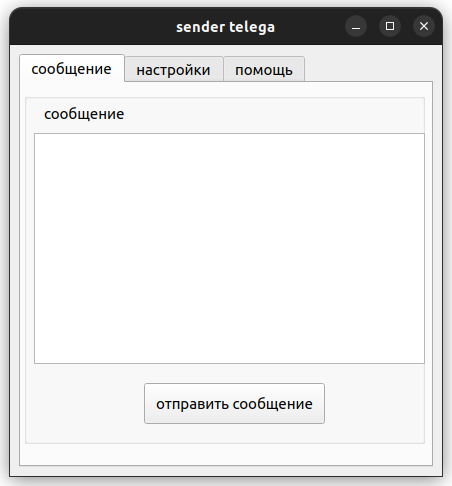
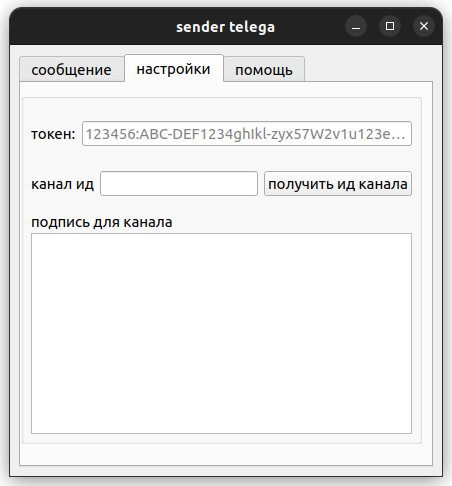
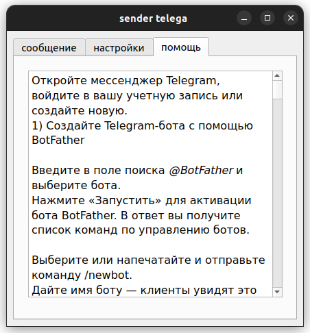

## Приложение
В этом проекте реализована простая графическая программа для отправки сообщений в телеграмм канал.

## Технологии
- Python
- Pyqt5
- Requests

### Запуск локально

+ Создайте virtual env и установите зависимости:
```
python -m venv venv
venv\Scripts\activate
pip install -r requirements.txt
```

## Скриншоты




## запуск
```
python main.py
```
или запустить из app соответствующую версию под вашу oc


### доделать
- тесты
- обработать ошибки на русский
- сделать рефакторинг кода